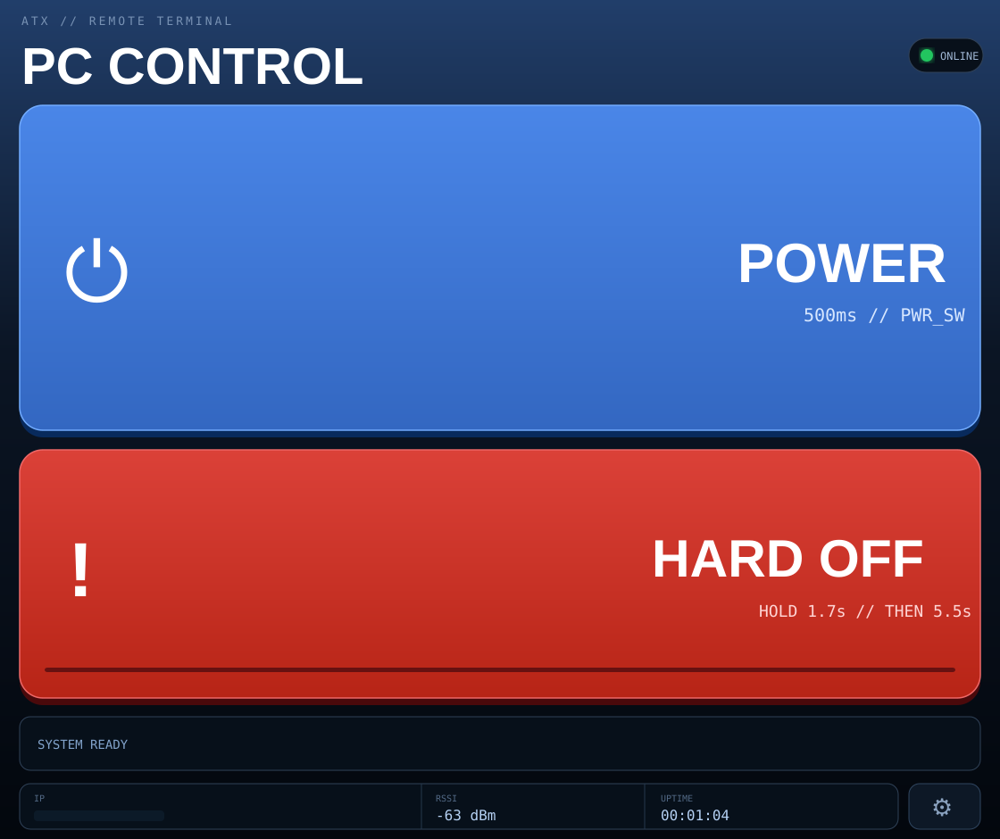
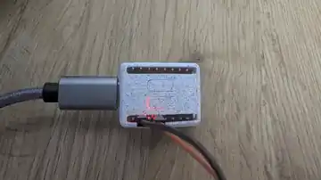

# ESP32-C3 Server IPMI

A lightweight, web-based **IPMI-style remote power controller** for an ESP32-C3 SuperMini.

> This project is **not an implementation of the IPMI protocol**. It provides similar basic remote power-control functionality through a local web interface.

## Preview

### Web UI

<p align="center">
  
</p>

### Hardware prototype

<p align="center">
  
</p>

The local IP address is intentionally omitted from the published UI preview. The hardware photo shows the current ESP32-C3 SuperMini prototype in its small enclosure with USB-C power and the PWR_SW wiring.

## Features

- ESP32-C3 SuperMini target
- Web UI for PC/server power control
- 500 ms `PWR_SW` pulse for normal power toggle
- Hold-to-confirm hard-off, followed by a 5.5 s `PWR_SW` hold
- Responsive, compact UI intended to fit without scrolling
- First-boot / fallback setup access point
- DHCP or optional static IPv4 configuration
- mDNS access, e.g. `http://pc-switch.local`
- Automatic Wi-Fi reconnect
- ESP32-C3 SuperMini Wi-Fi TX-power workaround
- Optional web login
- Factory reset from the web UI
- Configuration stored in ESP32 NVS / Preferences
- No Wi-Fi credentials hard-coded in the sketch

## Important safety note

This repository currently uses **direct open-drain control of the motherboard `PWR_SW` input**.

That wiring is motherboard-dependent. The safer and more portable solution is an optocoupler, PhotoMOS, transistor, or other isolated/open-collector interface.

Before using direct wiring:

1. Identify the two motherboard `PWR_SW` pins from the motherboard manual.
2. Measure each pin relative to motherboard ground.
3. Confirm which pin is the low-voltage logic signal and which is ground.
4. Do **not** connect a GPIO to an unknown or higher-voltage signal.
5. If you are unsure, use an optocoupler/transistor instead.

The firmware drives the output only as **open drain**. It never intentionally drives the motherboard signal high.

Repeated hard power-offs can cause data loss or filesystem corruption. Use **HARD OFF** only when a normal power-button action is not sufficient.

## Wiring

Current default pin:

```text
ESP32-C3 GPIO4
      |
     1 kΩ   recommended series resistor
      |
Motherboard PWR_SW signal

ESP32-C3 GND -------- Motherboard PWR_SW ground
```

The physical case power button can remain connected in parallel.

Do **not** connect ESP32 `3V3` or `5V` to the motherboard `PWR_SW` header.

### Why open drain?

The motherboard power button normally behaves like a momentary switch that pulls the `PWR_SW` signal to ground.

The sketch uses:

```cpp
pinMode(POWER_PIN, OUTPUT_OPEN_DRAIN);
```

and then:

```cpp
// released / high impedance
digitalWrite(POWER_PIN, HIGH);

// button pressed / pull to ground
digitalWrite(POWER_PIN, LOW);
```

## Arduino IDE

Recommended board settings:

```text
Board: ESP32C3 Dev Module
USB CDC On Boot: Enabled
Serial Monitor: 115200 baud
Erase All Flash Before Sketch Upload: Disabled
```

Required libraries are provided by the Arduino-ESP32 core:

- WiFi
- WebServer
- DNSServer
- Preferences
- ESPmDNS

Flash:

```text
ESP32C3_Server_IPMI.ino
```

## First start

If no valid Wi-Fi configuration exists, the ESP32 creates its own setup network:

```text
SSID:     PC-Switch-XXXXXX
Password: 12345678
Address:  http://192.168.4.1
```

Open the setup page and enter the target Wi-Fi credentials.

After reboot, the controller joins the configured network.

The serial monitor prints the assigned IP address.

You can then use either:

```text
http://<assigned-ip>
```

or, where mDNS works:

```text
http://pc-switch.local
```

The hostname is configurable.

## Web controls

### POWER

Sends a 500 ms `PWR_SW` pulse.

This is equivalent to briefly pressing the physical case power button.

### HARD OFF

The UI must first be held for about 1.7 seconds to arm the action. Only after that confirmation does the ESP32 hold `PWR_SW` low for 5.5 seconds.

The 1.7 seconds are **UI confirmation only** and are not sent to the motherboard.

## Settings

Open the gear icon in the main UI.

Available settings include:

- Wi-Fi SSID and password
- Hostname
- DHCP / static IPv4
- Gateway, subnet and DNS
- Optional login protection
- Start the device's own setup Wi-Fi
- Factory reset

## Optional login

Login protection is disabled by default.

Default credentials after a factory reset:

```text
User:     admin
Password: 1234
```

Change the password before relying on login protection.

The web server uses plain HTTP. The login therefore protects against casual access on a trusted LAN, but it does **not** provide encrypted transport.

Do not expose this device directly to the public Internet with port forwarding. Use a VPN or another trusted private-network solution for remote access.

## Network setup vs factory reset

### Start own setup Wi-Fi

This keeps the existing configuration and reboots into the ESP32 setup access point.

Use this when the device is installed inside a PC/server and the physical ESP32 buttons are not accessible.

### Factory reset

Factory reset clears the `pcswitch` Preferences namespace, including:

- Wi-Fi configuration
- hostname
- static-IP configuration
- optional login configuration

After reboot, the device starts the setup AP again:

```text
PC-Switch-XXXXXX
Password: 12345678
```

## Wi-Fi note for ESP32-C3 SuperMini

Some ESP32-C3 SuperMini boards are more reliable with reduced Wi-Fi TX power. The sketch therefore applies:

```cpp
WiFi.setTxPower(WIFI_POWER_8_5dBm);
WiFi.setSleep(false);
```

## Security

This project is intended for a trusted local network.

- HTTP is unencrypted.
- The default optional login password is intentionally simple: `1234`.
- Change it if login protection is enabled.
- Do not use router port forwarding to expose the ESP32 directly to the Internet.

## Troubleshooting

### Setup network does not appear

Open the serial monitor at 115200 baud and reset the ESP32.

A fallback setup boot should show information similar to:

```text
=== SETUP MODE ===
SSID: PC-Switch-XXXXXX
Passwort: 12345678
URL: http://192.168.4.1
```

### Wi-Fi connects with WLED but not this sketch

This project includes the reduced-TX-power workaround used because some C3 SuperMini boards behave poorly at higher Wi-Fi transmit power.

### PC immediately turns off after starting

Do not use a normal push-pull GPIO mode on `PWR_SW`.

The firmware must use `OUTPUT_OPEN_DRAIN`, with HIGH meaning released/high-impedance and LOW meaning pressed.

### `.local` does not resolve

Use the IP address printed in the serial monitor or shown in the UI. mDNS support depends on the client OS/network.

## Project status

This is a hobby project for local remote power control. Test the wiring carefully before leaving the device installed unattended.

## License

No license has been selected yet.